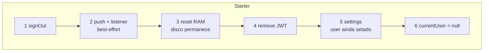
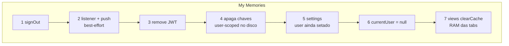

# Cache do starter × My Memories

Por que o logout daqui **não** apaga o disco, e o do My Memories **apaga**. Não unificar os dois sem um PR só disso.

O My Memories é o primeiro app saído deste molde. O starter **não** é um rename daquele código: extraiu o miolo de cache que estava espalhado nas stores e mudou a política de disco no logout.

## Os dois módulos

| | My Memories `domainCache.ts` | Starter `useEntityBucketCache.ts` |
|---|---|---|
| O que é | Utilitário **fino** de chave e wipe | Composable **completo** de cache |
| Faz | `prefix__userId__ano`, `captureCacheUserScope`, apagar chaves | `Map` por bucket, Preferences, guarda de escopo, `inFlight`, upsert/remove, `clear({ removePersisted })` |
| O que fica na store | O Map, persistir, fetch, `initialize` | Domínio, rede, loading, estado de tela |
| Disco no logout | `clearAllUserScopedDomainCacheKeys()` apaga as chaves de **todas** as contas no aparelho | `reset({ removePersisted: false })` — RAM fora, **disco fica** (a chave já tem o user) |

`domainCache` **continua** no My Memories. O composable nasceu aqui para a store nova não copiar o mesmo miolo. Não é o mesmo arquivo com outro nome.

A guarda de escopo (`captureCacheUserScope` lá / `ensureScope` + `isCurrentScope` aqui) resolve o mesmo problema: resposta atrasada do usuário A não pode gravar na conta B.

## Por que o disco diverge

No starter a chave já é `prefix:userId:bucket`. Contas não se misturam no Preferences. Preservar o disco faz o **mesmo usuário** reabrir o app com cache — abertura instantânea, regra do `AGENTS.md`.

No My Memories o `domainCache` **não** é o Map: só o nome da chave. Várias stores, tabs Ionic montadas. O logout apaga o prefixo no disco (`clearAllUserScoped…`) e as views fazem `clearCache()` na RAM (`MenuView` / `LoginPage`). O `auth.service` **não** percorre as stores. Store nova: entrar em `DOMAIN_CACHE_KEYS` **e** no `clearCache` das views.

Trade-off: no starter, logout + login do mesmo user lê disco. No My Memories, o disco user-scoped some; a próxima abertura daquela conta começa fria nesse cache.

## Logout — sequência

Passos best-effort (push, listener) e o contrato do JWT (`clearToken`, não reordenar) estão em [DECISOES-ARQUITETURAIS.md](./DECISOES-ARQUITETURAIS.md) §10. Abaixo só o que muda no **cache**.

### Starter (este repo)

`signOut()`: push → listener → `clearToken()`.

O passo 3 é `resetUserScopedStores()` → `taskStore.reset({ removePersisted: false })`. Store nova de domínio **tem** que entrar nessa lista.

### My Memories

`signOut()`: listener → push → `clearToken()`. A RAM das tabs sai nas **views**, não no auth.

O passo 4 é `clearAllUserScopedDomainCacheKeys()`. O passo 7 (`MenuView` / `LoginPage`) só no logout pelo menu — o `signOut()` do interceptor 401 não chama as views; as tabs montadas podem ficar com RAM até o próximo `clearCache`/navegação.

## O que não fazer

- Não portar `clearAllUserScopedDomainCacheKeys` para o starter “por paridade”: quebra a abertura com cache.
- Não portar `reset({ removePersisted: false })` para o My Memories no mesmo PR do auth: muda o cold start pós-logout de várias stores.
- Não nulificar `currentUser` antes do gancho de settings — [DECISOES-ARQUITETURAIS.md](./DECISOES-ARQUITETURAIS.md) §10.

## Arquivos

| Starter | My Memories |
|---------|-------------|
| [useEntityBucketCache.ts](../src/composables/useEntityBucketCache.ts) | `my-memories-frontend/src/utils/domainCache.ts` |
| [taskStore.ts](../src/stores/taskStore.ts) `reset` | `memoryStore` / `notificationStore` / … `clearCache` |
| [auth.service.ts](../src/services/auth.service.ts) `resetUserScopedStores` | `auth.service.ts` `clearAllUserScopedDomainCacheKeys` |
| — | `MenuView` / `LoginPage` `clearCache()` |
